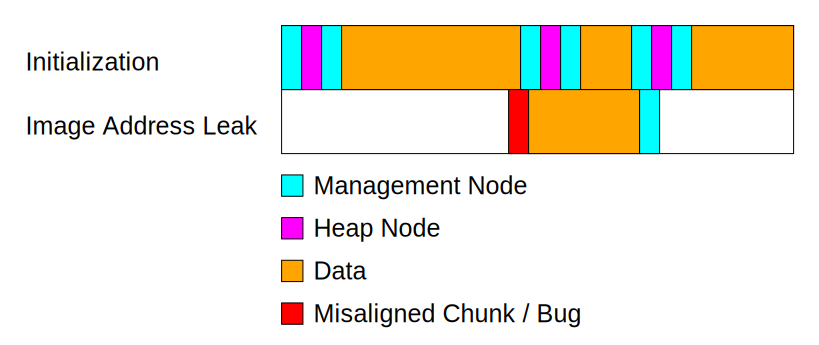

# WriteUp GreyCTF 2024 - HeapHeapHeap
## also known as $\text{Heap}^3$ or $\text{Pain}^3$

- Category: Pwn
- Solved by: Explosiontime202

## What do we have here?
### Heaps?

The program implements a max-heap. For those who don't know what a max-heap is:
Elements (or nodes) are logically ordered in a tree structure where the root node has the highest associated value. In the direction of the leafs, the values decrease monotonic. The tree is usually a binary-tree, so a node can have two children.
When an element is inserted into the heap, it is added as a leaf "somewhere" in the tree. If its value is greater than the value of the parent, the two nodes are swapped. This is repeated until the inserted node has a lower (or equal) value than the parent.
The beforehand mentioned "somewhere" is chosen, such that the tree is balanced. A simple algorithm and more explanation on the balancing is given in [this StackOverflow thread](https://stackoverflow.com/a/28397137/11168593).

The user can modify the max-heap with the following operations:

1. Add node: Add a new node to the heap. The user can provide the value used to order the nodes in the max-heap. Additionally a string of arbitrary length can be stored alongside the value.
2. Edit root: Edit the root node of the max-heap, i.e. the node with the maximum value. The user can edit both value and the string. The string editing is implemented by freeing the memory and allocating again with a different size.
3. Delete root: Remove the root node from the heap.
4. Exit the program.

After each operation, the values currently stored in the heap are printed.

The following structs are used in the implementation:
```c
struct Node {
    size_t value;
    struct Node *left;
    struct Node *right;
    struct Node *parent;
    void *data;
};

struct Heap {
    struct Node *max;
    unsigned char num_nodes;
};
```

The implementation is pointer-based, which means that a node has a pointer to a left child, a right child and to the parent.
If any of the relative nodes do not exists, the pointer is `NULL`. A node can store a pointer to associated `data` and also requires to store its associated value.

The heap struct stores the current root node, which is the node with the highest associated value. Also the current number of nodes in the heap is stored which is required for the tree balancing.

### HeapHeaps!

As it would be too boring to only have one heap, the challenge uses a second one to manage node allocations.
The following struct defines the state of the memory allocator: 

```c
struct HeapHeap {
    struct Heap heap;
    void *memory;
    void *top;
    size_t top_size;
};
```

The heap is used to store free chunks, similar to free lists in common memory allocators, for example ptmalloc. The values stored in the nodes are the sizes of the allocated memory and `data` points to the beginning of the associated memory.
`memory` points to the beginning of the entire arena. `top` and `top_size` define the top "chunk" which is the point where the wilderness begins and nothing has been allocated yet. (also not to be found in the free ~~list~~ heap).

The memory allocator serves memory from a predefined memory page located in the ELF file. I assume, for simplicity. (thank god, no "real" heap exploitation on modern glibc versions :skull:)

The memory allocation is built around the two functions `halloc` and `hfree`.

With `halloc` more memory from the allocator can be requested. It is either served from

1. the root node in the free heap,
2. the top chunk / wilderness.

If there is not enough space in neither of them, the implementation panics.

When the allocation is served from the root of the free heap, but not all of the associated memory is required, the node is split. The remainder is inserted back into the free heap, thus, a new node needs to be created at the start of the remaining memory. The following code is the implementation of that split:

```c
if(old_size == size) {
    return node->data;
}

struct Node *new_node = node->data + size;
new_node->data = (void*)new_node + NODE_SIZE;
new_node->value = old_size - NODE_SIZE - size;
insert(&heap_heap.heap, new_node);
```

As we can see, there is no check that there is actually enough space for another node after the allocation. This can lead to overlapping chunks. This is the bug which we are gonna exploit and get RCE from.

`hfree` adds the given chunk back to the free heap:

```c
void hfree(void *ptr) {
    struct Node *node = ptr - NODE_SIZE;
    insert(&heap_heap.heap, node);
}
```

### HeapHeapHeap ?! :confused:

The binary was compiled with the following security measurements:

- Partial RELRO
- NX
- PIE

We also can assume that ASLR is active as it is standard on modern GNU/Linux systems.

Given the activated security measures, a GOT overwrite is possible. To locate the GOT in memory the base address of the ELF image has to be known. Luckily, the heap-based memory allocator contains pointers pointing into the image because the arena of the allocator is a page in the image. Therefore, any `left`, `right`, `parent` or `data` pointer is a image pointer.

Conveniently, the challenges has a builtin backdoor function, which calls `system("/bin/sh")`. So, overwriting one of the functions in the GOT with the address of the backdoor function and then calling this function, the challenge is solved.

Now that we know our target (GOT overwrite with backdoor address
) and the vulnerability (overlapping chunks), we need to built the hard part of the exploit: The path into the GOT.

I will refer to nodes of `heap` as "heap nodes" and the nodes in `heap_heap.heap` as management nodes because they are used for the memory management. As `chunks` I will refer to the combination of two management nodes, one heap node and one data segment. For example, adding one value-string pair to `heap` creates one chunk. As length or size of a chunk, I will usually refer to the length of the data segment of this chunk.

## how I GOT there

### Leak image base address or why this allocator is garbage

First of all, we need to trigger the bug and thus create overlapping chunks. In order to do that, 

1. we need to be served from the root node of the free heap and
2. the remaining size must be in the interval $(0, \text{sizeof(Node)}) = (0, 0\text x28)$.

To fulfill the first condition we allocate all the available memory in three chunks:

1. A 0xa00 chunk, value = 1337
2. A 0x100 chunk, value = 136
3. The rest (0x398 B), value = 420

(Note: all of the values are chosen totally randomly and have no pattern whatsoever, except for their ordering, i.e. value(1. chunk) > value(2. chunk) and so on. This is also true for the rest of the exploit.)

Note that for every of the previously mentioned chunks we also need to account for the space of the two heap allocator management nodes and the one heap node. So we need $3 \cdot \text{0x28} + x$ bytes for one of the chunks of size $x$.

Now we can use the `edit` functionality to make the first chunk smaller because the first chunk is the chunk with highest value. We shrink the chunk by 0x20 bytes so that the node describing the rest of the split chunk memory overlaps by 8 bytes with the next node. Moreover, the value (i..e the size) stored for the remainder chunk is $-8$ or rather 0xFFFFFFFFFFFFFFF8 as it is a `size_t`. This means that for now all further allocations are served from that chunk. Note that we need to put null-bytes into the associated string because we require that memory later on to be zero.
Additionally, we reduce the assigned value to 69, so that we can edit the second chunk. 

Editing the second chunk with a value of 70 and a new length of $0 \text x 178 = 0\text x 28 \cdot 3 + 0\text x 100$. The length is chosen so that the allocated string overlaps all of the chunks previously associated with the second chunk: Two management nodes, a heap node and the previous string. After this allocation, the allocator again puts the chunk describing the rest of the free memory. The new node's `data` now exactly overlaps with `heap.max->value` placing a image pointer into the value.

We cannot write more than 0x10 bytes to the string because we then overwrite the node stored in the heap which will lead to triggering assertions or even segfaults. Luckily, the program allows us to allocate more memory for the string as actually required.

The schematic below shows all the allocated chunks up to this point, but not to scale.


The large rectangle is the heap managed by `heap_heap`. The upper row are the chunks created during the setup steps of the exploit and the lower row is the chunks created to leak the image address. In reality, those chunks overlap, but for better readability they are separated vertically.

One can see the misaligned management node in red which leads to the cyan node from the lower row overlapping with the last magenta node from the upper row.

### The path to GO~~D~~T

Through the leak, we can calculate the image base address and are now able to forge pointers.

The first mission is to clean up the heap to avoid triggering sanity checks in the heap management because we corrupted the second chunk's nodes. To do that we add a new chunk with a length greater than the distance where the heap is stored. Luckily the heap is stored after `mem`, the arena of the allocator. Therefore we allocate a string with 0x390 null-bytes as padding, $\text{mem} + 0\text x200$ as `heap.max` and $1$ as `heap.num_nodes`. Effectively setting:
```c
heap = {
    .max = mem + 0x200,
    .num_nodes = 1
};
```

This means that the heap now contains one node and the node is located at an offset of $0\text x200$ from the start of the arena. This is now in the region where the first chunk was previously allocated. This is also the reason we required to fill the first chunk with null-bytes or else further allocations would lead to failing assertions and segfaults.

The next step is to allocate a dummy chunk of some length $length_{dummy}$ which we will edit later on. The value can be arbitrary, I chose to use $500$.

Now to the interesting part: Pivoting toward the position where we previously pointed a node in `heap` to. We do that by editing the dummy chunk with a size of 
$$\begin{align*} length_{pivot} &= target - cur\_top \\ &= (mem + 0\text x200 - 0\text x28 \cdot 2) - (mem + 0\text x1110 + 0\text x10 + 0\text x28 \cdot 4 + length_{dummy}) \\ &= -0\text x1000 - length_{dummy}\end{align*}$$

As we interpret the negative number $length_{pivot}$ as an 64bit unsigned number, the resulting length is very large. But be aware to not write that many bytes, no current computer has Exabytes of RAM xD

To explain that formula a bit:

1. We want to pivot from the current top chunk to the target address
2. The target address is 2 node chunks before our targeted fake chunk address, an actual management node will be placed there. Additionally, when editing the dummy again (to write the fake chunks), we need a management node before the heap node as well.
3. `0x1110` is the offset of heap and `sizeof(Heap) = 0x10`.
4. The add of the dummy node allocated 3 nodes, i.e. $0\text x28 \cdot 3$, and a data chunk with length $length_{dummy}$.
5. An additional management node is placed after the last allocation, i.e. another $0\text x28$, and we do need the address of the next allocation.

After pivoting, we can put the fake chunks into the memory using an edit. The following C-style initialization specifies the relevant fields, all the others can be chosen to fill with any value.
```c
struct Node fakes_nodes[3] = {
    // management node 1
    struct Node {
        .value = 0x28,
        .left = NULL,
        .right = NULL,
        .data = target + 0x28 * 2,
    },
    // heap node
    struct Node {
        .value = 0x1000,
        .left = NULL,
        .right = NULL,
        .parent = img_base + 0x5138,
        .data = target + 0x28 * 4,
    },
    // management node 2
    struct Node {
        .value = 0x50000,
        .left = NULL,
        .right = NULL,
        .data = &exit@got[plt]
    }
};
```

We need to edit again, to trigger the correct sorting of the heap, i.e. that our fake heap node is at the top of the heap. Also make sure to set a value lower than the value of the fake heap node's value during using the edit.

A delete puts the pointer into to `&exit@got[plt]` into the free heap and with another edit, one can overwrite GOT with any pointer.

To trigger RCE, we just need to quit the program, which is conveniently offered by the challenge.

